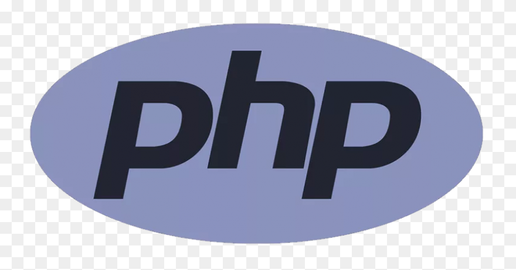
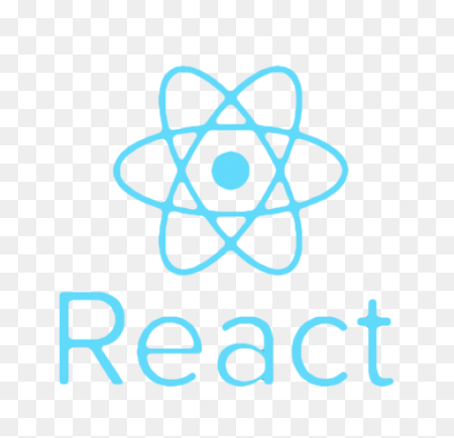
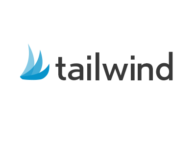

<h2 align="center"> Hey there! I'm Catherine Guo. </h2>

<h3 align="left"> 👨🏻‍💻 About Me </h3>

🌱 &nbsp;Based in Paris, France. 
💼 &nbsp;Working on web development projects with a touch of creativity and passion. 
🶠&nbsp;K-RNB & K-dramas addict — always coding with the best soundtrack. 
🛩 &nbsp;Love exploring new tech, solving problems, and adding a bit of sparkle to every project I touch. 
💡 &nbsp;Believer in constant learning and blending culture with code.  

<h2 align="left"><a href="#">👉 [My Website coming soon]</a></h2>

 

<h2 align="center">
  👷🏼 Here are some technologies I use on a daily basis:
</h2>

 &nbsp;&nbsp;
 &nbsp;&nbsp;
 &nbsp;&nbsp;

 &nbsp;&nbsp;
 &nbsp;&nbsp;
 &nbsp;&nbsp;
 &nbsp;&nbsp;
<!--img height="50" src="https://github.com/chandan-reddy-k/chandan-reddy-k/blob/master/assets/graphql.png"--> &nbsp;&nbsp;
 

<h1 align="center">⬇ Connect with Me ⬇</h2>
<h2>
&nbsp; <a href="#" target="_blank" rel="noopener noreferrer"><strong> : [My website coming soon]</strong></a>  
</h2>
<h2>
&nbsp; <a href="https://www.linkedin.com/in/cathguo" target="_blank" rel="noopener noreferrer"><strong> : My LinkedIn Profile</strong></a>  
</h2>
<h2 align="center">... or just take a look of my GH repositories just down below!</h2>

<h2 align="center">
&nbsp; <a href="https://github.com/Catcathg?tab=repositories" target="_blank" rel="noopener noreferrer"><strong></strong></a>  
</h2>
